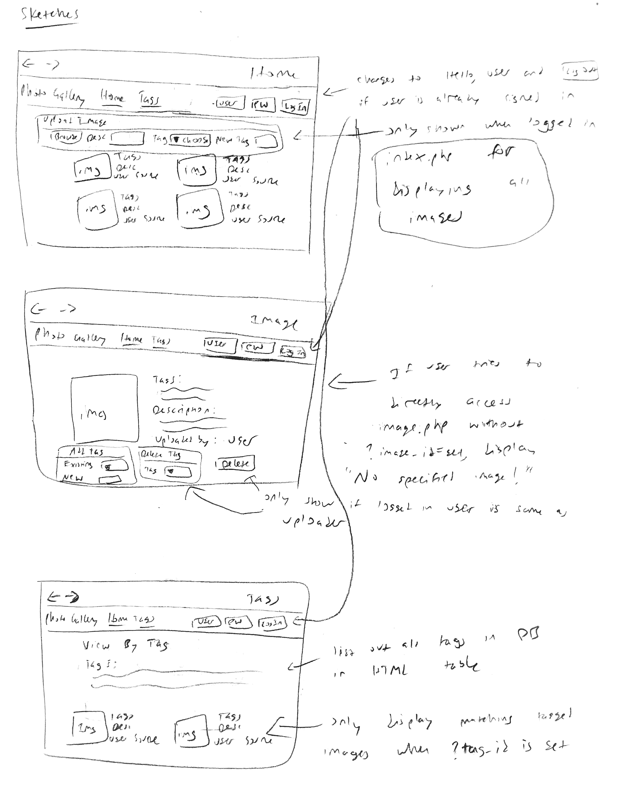
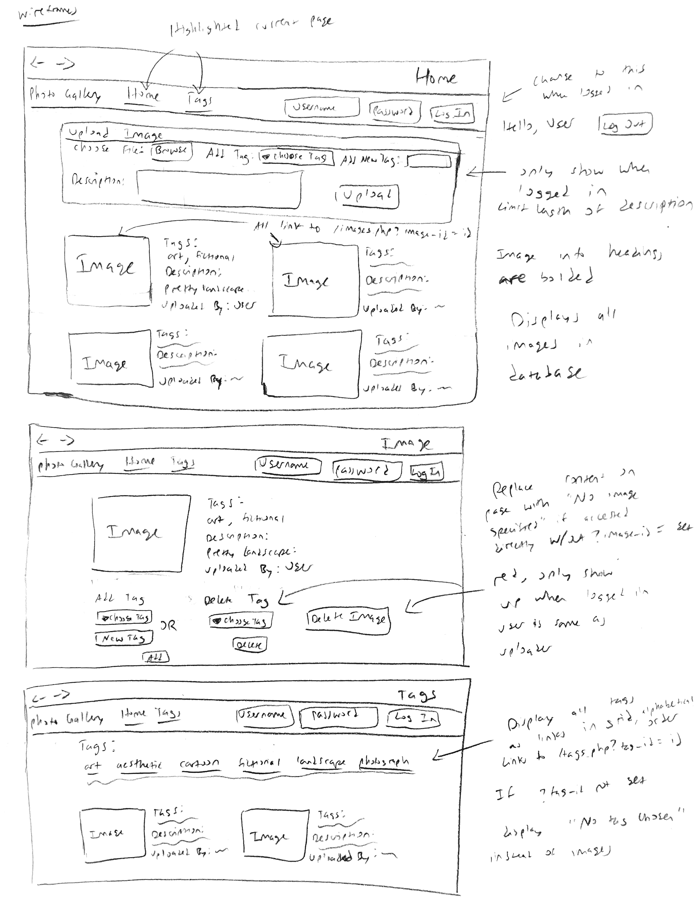

> Hello. Please read through the comments we have left on your design plan and make sure to make changes to your design plan and website based on the feedback we give you.

> Comments are listed inside block quotes like this, so make sure to look carefully!

> If a section in your design plan doesn’t have block quotes, then you’re good to go for that section! If there are block quotes, there’s a good chance you’ve missed something crucial.

# Project 3 - Design & Plan

Your Name: William Wang

## 1. Persona

I've selected **Abby** as my persona.

I chose Abby as my persona because she tends to use familiar things over trying
to learn new ones. This means that my website's design should be as simple as possible
and easy to tell what everything is for so the website is either immediately familiar
to her or it is very easy to figure out how to do the things she wants to do.
Designing for her persona has the added benefit of being conducive towards other
personas as well because an easy to use website makes it easier for any user.

## 2. Sketches & Wireframes

### Sketches



### Wirefames



My design is effective for Abby because it hides the user access controls when the
anonymous or logged in user can't use it. The forms for uploading images, adding tags,
and deleting tags are also clearly labeled so it is easy for Abby to quickly figure
out how to do the things she wants. It is also intuitive and familiar to Abby that
she can click an image in the gallery to view an image by itself and access editing
the image tags. The log in form or log out button is also always visible in the header
depending on whether or not the user is logged in so it is easy to find. The tags page
is also intuitive because by clicking on a listed tag the user can see all images
under that tag. If the user does is on image.php or tags.php without specifying
a tag or image to look at, there is also a message that tells the user what went wrong.
Therefore this design matches Abby's personality because it is intuitive and clearly
labeled so it is obvious what everything does.

## 3. Database Schema Plan

Table: users
* id: INTEGER NOT NULL UNIQUE PRIMARY KEY AUTOINCREMENT
* username: TEXT NOT NULL UNIQUE
* password: TEXT NOT NULL
* session_id: TEXT UNIQUE

Table: images
* id: INTEGER NOT NULL UNIQUE PRIMARY KEY AUTOINCREMENT
* file_name: TEXT NOT NULL
* file_extension: TEXT NOT NULL
* description: TEXT
* upload_user: TEXT NOT NULL

Table: tags
* id: INTEGER NOT NULL UNIQUE PRIMARY KEY AUTOINCREMENT
* tag_name: TEXT NOT NULL UNIQUE

Table: gallery
* image_id: INTEGER NOT NULL
* tag_id: INTEGER NOT NULL

> This looks good! I would recommend giving your gallery table an id

## 4. Database Query Plan

* Your persona should be able to view all images in your photo gallery at once.

  SELECT images.\*, tags.tag_name
  FROM images
  LEFT JOIN gallery
  ON images.id = gallery.image_id
  LEFT JOIN tags
  ON gallery.tag_id = tags.id;

* Your persona should be able to view all images for a tag at once.

  SELECT images.\*
  FROM images
  JOIN gallery
  ON images.id = gallery.image_id
  JOIN tags
  ON gallery.tag_id = tags.id
  WHERE gallery.tag_id = [user_inputted_tag_id];

  Can also change to match tag_name instead of tag_id

* Your persona should be able to view a single image and all the tags for that image at once.

  SELECT images.\*, tags.tag_name
  FROM tags
  JOIN gallery
  ON tags.id = gallery.tag_id
  JOIN images
  ON gallery.image_id = images.id
  WHERE gallery.image_id = [user_inputted_image_id];

* Your persona should be able to upload a new image.

  INSERT INTO images (file_name, file_extension, description, user)
  VALUES ([filename],[ext],[desc],[current user]);

  Description optional, may not be included

* Your persona should be able to remove (delete) an image. Make sure you clean up
any relationships to the image in other tables. (Where the image is a foreign key.)
Make sure you delete the corresponding file upload from disk.

  SELECT file_name, file_extension FROM images WHERE id = [img id];

  unlink("/uploads/" . $file_name . "." . $file_extension);

  DELETE FROM images WHERE id = [img id];

  DELETE FROM gallery WHERE image_id = [img id];

* Your persona should be able to view all tags at once.

  SELECT tag_name FROM tags ORDER BY tag_name ASC;

* Your persona should be able to add an existing tag to an image, add a new tag to an image, and remove a tag from an image.

  * For adding an existing tag to an image

    INSERT INTO gallery (image_id, tag_id) VALUES ([img id], [tag id]);

  * For adding a new tag to an image

    INSERT INTO tags (tag_name) VALUES ([tag name]);

    $new_tag_id = $db->lastInsertId("id");

    INSERT INTO gallery(image_id, tag_id) VALUES ([img id], :new_tag_id);

  * For removing a tag from an image

    DELETE FROM gallery WHERE image_id = [img id] AND tag_id = [tag id];

> Really good job!

## 5. Structure and Pseudocode

### Structure

* **includes/init.php** - stuff that useful for every web page, useful functions, useful variables, etc.
* **includes/header.php** - have navigation bar for all webpages, log in form, log out button
* **index.php** - main page, view all the images at once, when a specific image is clicked go
to the image.php?image_id= ? for that image, upload image form
* **image.php** - view a specific image chosen by the user and display all the tags
associated with the image, description, user who uploaded image, add/delete tags form, delete image button
* **tags.php** - view all tags, when a tag is clicked view all images associated with that
particular tag with tag.php?tag_id= ?

### Pseudocode

#### index.php

```
include init.php

include header.php

if POST for upload image is set
  valid_file = true
  validate and sanitize user inputs from form

  if invalid image file extension
    valid_file = false
  end

  if both existing tag / new tag input are set
    valid_file = false
    notify user that only one can be done at a time
  end

  if only existing tag set
    if not in existing tags db
      notify user tag doesnt exist
      valid_file = false
    end
  end

  if only new tag set
    query new tag to see if already exists in tags db
    if records > 0 returned from query
      valid_file = false
      notify user that tags must be unique
    end
  end

  if valid_file
    rename and put uploaded file into uploads folder
    insert record into images db
    if only existing tag set
      insert record into gallery db with image id and tag id
      notify user of successful upload
    end
    if only new tag set
      insert record into tags db
      insert record into gallery db with image id and new tag id
      notify user of successful upload
    end
  end
end

print_notif(gallery_notifications)

// there is a logged in user
if current_user != NULL
  display upload image form
end

query all images in database

if returned records
  display images with tag/description/uploader next to it in a grid
else
  print out "No images in gallery"
end

```

#### includes/init.php

```
login_notifications = array to store errors/success messages for user during login/logout
gallery_notifications = array to store errors/success messages for user while changing photo gallery db

pages = array to store all the webpages in the website

function record_notif($notif)
  add notif to notifications array
end function

function print_notif($notifications)
  foreach notifications as notif
    print out notif
  end foreach
end function

// DB helper functions (you do not need to write this out since they are provided.)

db = connect to db

function check_login()
  if cookie session for a currently logged in user is set
    query the username of the user with matching session cookie
    if found a user with matching session cookie
      return username from database
    end
  end

  return null for no logged in user otherwise
end function

// ALL NOTIFICATIONS TO USER HERE ARE PUSHED TO login_notifications

function login($user,$pw)
  if valid $user and $pw
    query db for matching username
    if found user
      if password matches input password from login form
        generate session id
        update session id for user logging in in db
        if successfully updated session id
          set browser cookie to generated session id
          notify user of successful login
          return username of logged in user
        end
      else
        notify user of incorrect password
      end
    else
      notify user of incorrect username/password
    end
  else
    notify user of invalid username/password
  end

  return null for failed login of user
end function

function logout()
  if there is a currently logged in user
    set session id of currently logged in user to NULL
    unset browser cookie of session id
    set current_user to NULL for no currently logged in user
  end
end function

if POST request for login form is set
  validate and sanitize username and password sent from form
  current_user = login(user, pw)
end

if POST request for logout button is set
  logout()
  notify user of successful logout
end

//check if there is a currently logged in user
current_user = check_login()

```

#### includes/header.php

```
foreach page in pages
  if current page
    mark link with current page class
  else
    print out link to pages
end foreach

print_notif(login_notifications)

if current_user == NULL
  //user is not currently logged in
  show log in form and log in button and after log in return to index.php
else
  //there is a currently logged in user
  print out Hello, current_user
  display log out button
end

```

#### image.php

```
include init.php

include header.php

if POST add tag is set
  valid_tag = true
  sanitize and validate user input

  if both existing / new tag input set
    notify user that only one can be done at a time
    valid_tag = false
  end

  if only existing tag set
    if not in existing tags db
      notify user tag doesnt exist
      valid_tag = false
    end
  end

  if only new tag set
    query from tags db new tag
    if records > 0
      notify user tag already exists and must be unique
      valid_tag = false
    end
  end

  if valid_tag
    insert new tag into tags db if there is new tag
    insert record into gallery with image id and tag id
    notify user of successful addition of tag
  end
end

if POST delete tag is set
  sanitize and validate user input
  valid_tag = true

  if tag not attached to image
    valid_tag = false
    notify user that image doesnt have this tag
  end

  if valid_tag
    delete record from gallery db with specified image and tag
  end
end

if POST delete image button is set
  delete record from images db
  delete records with image id from gallery db
end

if GET image_id is set
  print_notif(gallery_notifications)
  query image info using image id from gallery db
  display image and image information
  display add tag form
  if current_user = uploader
    display delete tag form and delete image form
    populate delete tag form with tags image has from gallery db
  end
else
  display "No image specified."
end

```

#### tags.php

```
include init.php

include header.php

print tags header
display all tags from tags db in grid and as links to tag_id GET request

if GET tag id is set
  query db for images with matching tag
  display images with info/tags next to it in a grid
else
  display "No tag selected"
end

```

> This is really good pseudocode! However, make sure you keep track of where you will filter user input. Apart from that, this looks really good.

## 6. Seed Data - Username & Passwords

* admin : password
* realuser : realpassword


> ## Skeleton Website Feedback
> Great job!
